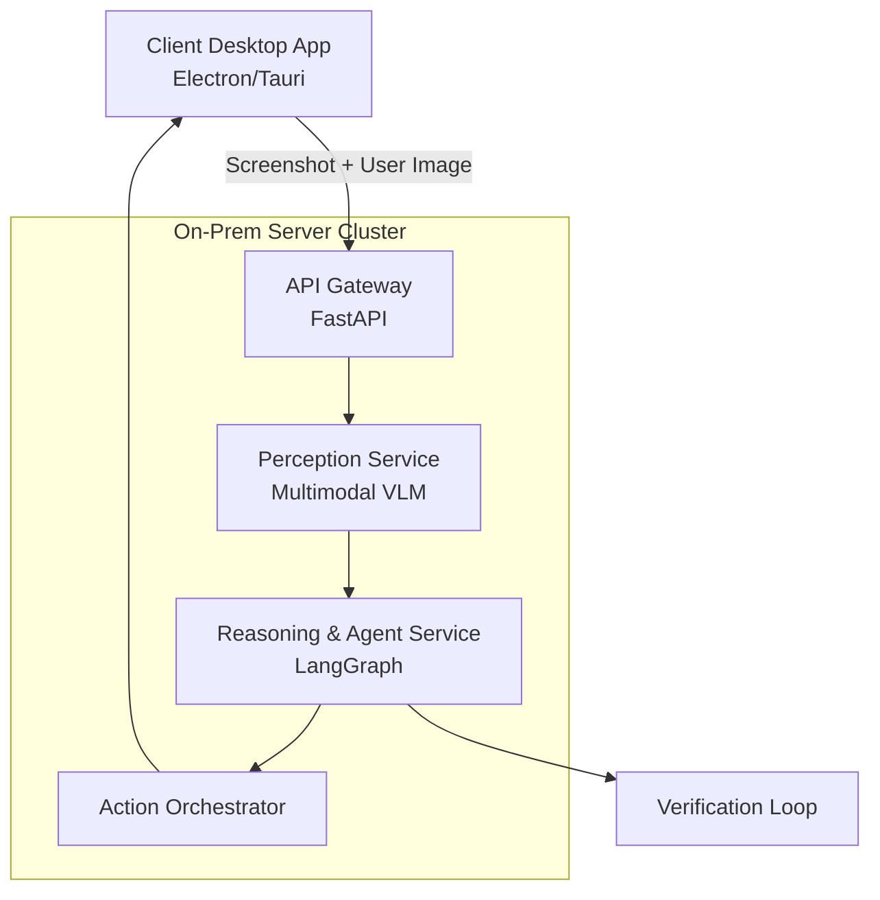

# 멀티모달 LLM 기반 CUA (Computer Using Agent) 온-프레미스 개발 가이드

**버전**: 1.0  
**작성일**: 2026년 6월  
**목적**: A6000 2대 환경에서 중국 모델 제외, 멀티모달 CUA 서비스 개발을 위한 방법론, 아키텍처, 기술 스택 상세 가이드

## 1. 프로젝트 요구사항 요약
- 멀티모달 LLM을 활용한 CUA 서비스
- 처음 보는 화면 처리 (사용자 이미지 업로드 지원)
- 중국 계열 모델 완전 배제 (백본 포함)
- 온-프레미스 + 폐쇄망 지원 (Air-gapped)
- 서버-클라이언트 구조
- 수백 명 동시 요청 처리
- 높은 Action 정확도 요구 (CUA 핵심)

**하드웨어**: NVIDIA A6000 × 2대 (각 48GB VRAM, 총 96GB)

---

## 2. 개발 방법론

### 추천 방법론
- **Iterative Agile + Evaluation-Driven Development + MLOps**
- Domain-Driven Design (DDD): Perception, Reasoning, Planning, Action, Verification Context 분리
- Red Teaming & Continuous Evaluation
- Human-in-the-Loop (HITL) + RLHF/DPO 피드백 루프

### 개발 단계 (로드맵)
1. **Phase 1 (PoC, 4주)**: 단일 화면 인식 + 기본 Action
2. **Phase 2 (8주)**: Multi-turn Agent + Reflection + Error Recovery
3. **Phase 3 (6주)**: Scalability & On-prem Productionization
4. **Phase 4 (Ongoing)**: Fine-tuning, Monitoring, Optimization

---

## 3. 전체 아키텍처



### 서버-클라이언트 구조
- **Client**: 화면 캡처, Action 실행, 이미지 업로드
- **Server**: LLM Inference + Agent Logic (A6000 2대에서 inference)

---

## 4. 기술 스택 상세

### 4.1 Frontend / Client
- **UI Framework**: Electron 또는 Tauri (Rust backend 추천)
- **화면 캡처**: `mss` (Windows), `screencapture` (macOS), `wayland` (Linux)
- **Action Execution**: `pyautogui` + OS Accessibility API (UIAutomation / AT-SPI)
- **Communication**: WebSocket + gRPC (실시간 Action Streaming)
- **Sandbox**: trycua/cua sandbox (권장)

### 4.2 Backend
- **Language**: Python 3.11+
- **API Framework**: FastAPI
- **Orchestration**: LangGraph (LangChain Ecosystem)
- **Agent Pattern**: ReAct + Reflection + Hierarchical Planning + Tool Calling

### 4.3 Multimodal Models (중국 모델 제외)
**추천 조합** (A6000 2대에 최적화):

| 모델 | 용도 | Quantization | VRAM 예상 | 비고 |
|------|------|--------------|----------|------|
| **Llama 3.3 Vision 70B** 또는 **Llama 4 Vision** | Main VLM (Perception + Reasoning) | AWQ 4-bit / FP8 | 40~45GB | 최고 우선순위 |
| **Florence-2 Large** | Element Grounding / OCR | 8-bit | 12~18GB | 보조 |
| **Molmo-72B** 또는 **PaliGemma 2** | Alternative Vision | 4-bit | ~35GB | Meta/Google |

- **Inference Engine**: **vLLM** (최고 추천) + TensorRT-LLM
- **Serving**: vLLM with Continuous Batching, PagedAttention
- **Multi-GPU**: Tensor Parallel (2 GPUs)

### 4.4 Infrastructure
- **Container**: Docker + Docker Compose (초기) → Kubernetes (추후)
- **Orchestration**: Kubernetes + KEDA (auto-scaling)
- **Model Serving**: vLLM OpenAI Compatible Server
- **Caching**: Redis (context cache)
- **Monitoring**: Prometheus + Grafana + LangSmith (Agent tracing)
- **Vector DB**: Chroma 또는 pgvector (RAG for domain knowledge)

### 4.5 Security & On-Prem
- Air-gapped deployment
- mTLS 내부 인증
- 모델/이미지 사전 다운로드
- SELinux / AppArmor
- Sandboxed Action Execution

---

## 5. 하드웨어 활용 계획 (A6000 2대)

**총 VRAM**: 96GB

**권장 배포 전략**:
1. **Single Node Multi-GPU** (추천)
   - GPU 0: Primary VLM (Llama Vision 70B 4-bit)
   - GPU 1: Secondary Model + LoRA Adapters + Batch Inference
2. **Tensor Parallel (TP=2)**: 하나의 큰 모델을 2 GPU에 분산
3. **LoRA Switching**: 여러 task-specific LoRA를 메모리에 로드

**예상 Concurrent Users**:
- 4-bit quantization + continuous batching 시 **80~150 concurrent** (작업 복잡도에 따라 다름)
- Peak 시 Dynamic LoRA + Speculative Decoding 적용

---

## 6. Action 정확도 향상 전략
1. **Visual Grounding**: Set-of-Mark (SoM), Coordinate Prediction
2. **Hybrid Perception**: Vision + Accessibility Tree (가능 시)
3. **Verification Loop**: Action 실행 후 Screenshot 비교 → Self-Correction
4. **Fine-tuning**: GUI datasets (OSWorld, ScreenSpot, Mind2Web) + Custom data
5. **Prompt Engineering**: Structured JSON output + Few-shot examples

---

## 7. 구현 로드맵 상세

### Phase 1: PoC
```bash
# 주요 명령어 예시
pip install vllm langgraph fastapi pyautogui
python -m vllm serve meta-llama/Llama-3.3-70B-Vision-Instruct --tensor-parallel-size 2 --quantization awq
```

### Phase 2~3: Production
- Kubernetes Helm Chart 배포
- CI/CD with GitHub Actions (on-prem GitLab)
- Automated Evaluation Pipeline

---

## 8. 위험 및 대응
- **VRAM 부족**: Aggressive 4-bit + Layer Pruning
- **Latency**: Speculative Decoding + Context Caching
- **Action 실패율**: Multi-path Planning + Human Escalation
- **보안**: Strict Sandbox + Permission Control

---

**참고 자료**
- vLLM Documentation
- LangGraph Best Practices
- OSWorld / ScreenSpot Benchmarks
- trycua / OpenCUA GitHub

---
이 문서는 실제 프로젝트의 Living Document로 활용하세요. 필요 시 업데이트하여 사용 바랍니다.
